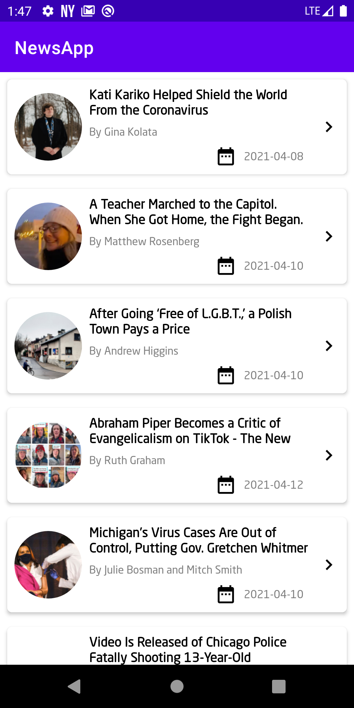
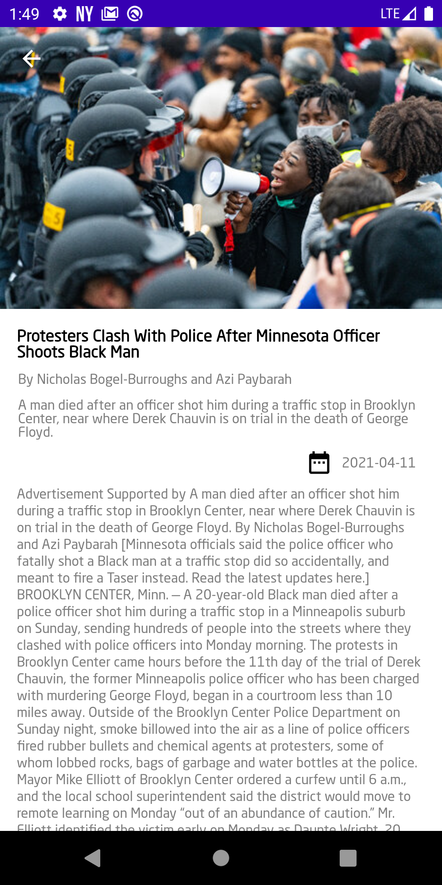
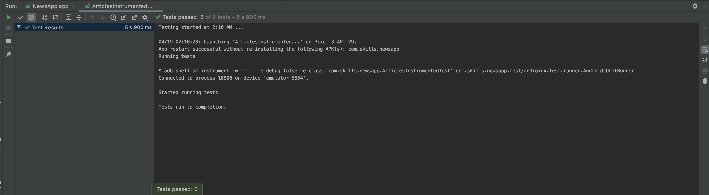
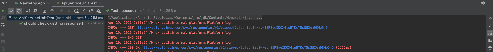
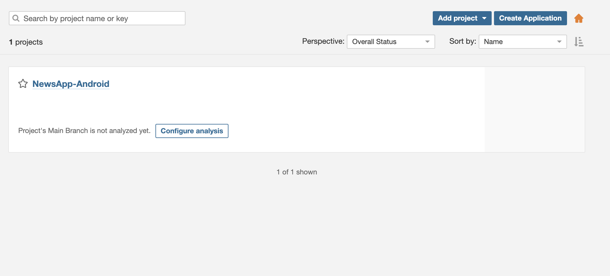
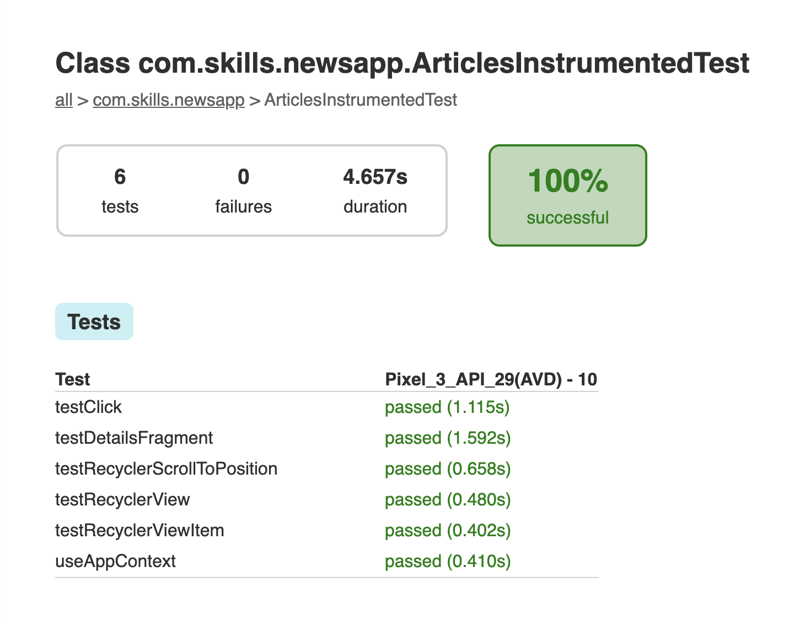

# NewsApp Most Popular Articles

An app to hit the NY Times Most Popular Articles API and show a list of articles, that shows details when items on the list are tapped, 
1. Article list are fetched from network and cached in Room database
2. When any Article is tapped then we fetch long content description from that article url, on response content is updated in already cached article in       database. And upon next time when user lands on detail page content fetched from database. 
3. There is swipe to refresh which will fetch fresh data from network, by default it will show from database first if available otherwise it will fetch from network.
4. This project based on MVVM architecture using kotlin, Dagger2, Retrofit, Coroutines, LiveData, RoomDatabase, DataBinding and Navigation Component ,Espresso, UnitTest cases.
5. Reports genrating tools are used in this Jococo and code quality and maintainability sonar is configured (Report from sonar is genrating, for seeing them need licence key).

<br>
<p align="center">
    
    
</p>
<br>

## The app has following packages:
1. **data**: It contains all the data accessing and manipulating components and repositories.
2. **databinding**: It contains all the data binder functions.
3. **di**: Dependency providing classes using Dagger2.
4. **ui**: View classes along with their corresponding Presenters.
5. **utils**: Utility classes.
#### Classes have been designed in such a way that it could be inherited and maximize the code reuse.
<br>

### Features
1. Object Oriented Programming Approach <br/>
2. MVVM Architecture <br/>
3. Dagger 2 for Dependency Injection <br/>
4. Android Jetpack Components <br/>
5. Retrofit and Okhttp <br/>
6. Room database for caching <br/>
7. Coroutines for asynchronous operations <br/>
8. Databinding <br/>
9. Jsoup for HTML parsing <br/>
10. Espresso for functional UI testing <br/>
11. Junit testing <br/>
12. JOCOCO for coverage report generation <br/>
13. Sonar for code quality, code bugs and generating report <br/>

<br>

## UI Testing Screenshot





## Unit Testing Screenshot





## Sonar project created from current configuration (to use it need valid licence)



## Graphical test report



# Build code

Open terminal and type the below command to generate debug build <br/>

``` ./gradlew assembleDebug ```

Open terminal and type the below command to generate release build <br/>

``` ./gradlew assembleRelease ```

<br/>

## Code Coverage
A coverage report can be generated using `gradlew createDebugCoverageReport`command-line via Gradle
Then you can find it at  `app\build\reports\coverage\debug\index.html`

